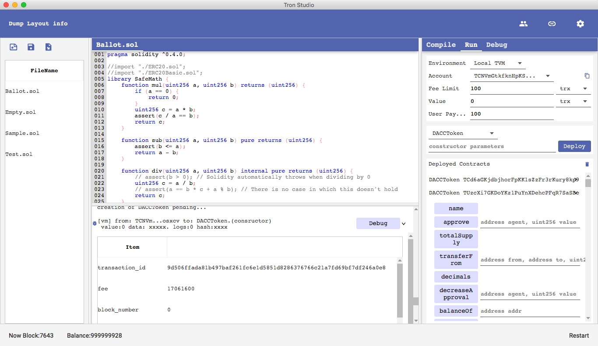

## Documentation

[Tron Studio Documentation](https://developers.tron.network/docs/tron-studio-intro)

## Tron Studio
TronStudio is an IDE to develop/deploy/debug smart contract based on TVM.


## Screenshot


## System Requirement
Oracle JDK 1.8

- Windows 64Bit
- Linux 64Bit
- Mac


## Compile & Run
```
./gradlew build -x test -x check
cd  build/libs
java -jar TronStudio.jar
```
## Compile contract Nullpointer quick fix:
 https://github.com/tronprotocol/tron-studio/issues/8 
